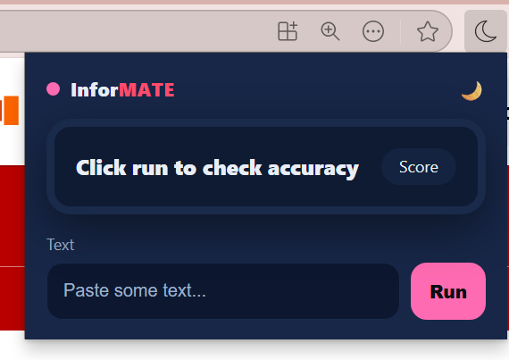
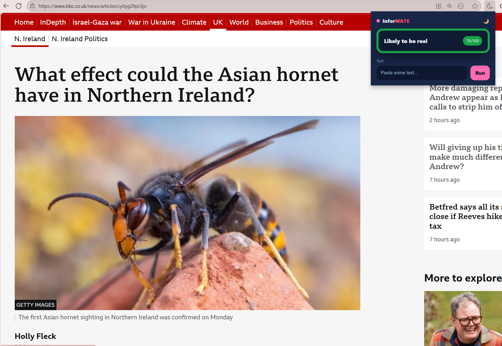

# 🌙 InforMATE - WHACK

## 💡 Problem Statement (Brevan Howard Challenge)
Accurate information is critical for effective decision-making. However, distinguishing factual content from misleading or biased information is increasingly difficult.  
**Challenge:**  
> Build a solution that helps users understand and assess information accurately.

---

## 🚀 Our Solution

**InforMATE** is an **AI-powered Chrome extension** that helps users evaluate the accuracy of online information, from news headlines to tweets. The tool extracts text from the active tab, sends it to a Flask backend, and leverages trained AI models to provide an accuracy score. It also supports **multilingual content** via Google Translate API, ensuring global applicability.

---

## 🧩 Tech Stack
**Frontend (Extension):**
- Vanilla JavaScript  
- HTML/CSS  
- Chrome Extension APIs  

**Backend:**
- Python  
- Flask  
- AI/ML Models (Custom-trained for content accuracy analysis)
---

## 🔧 Setup Instructions

1. Clone the repository. 

### Install requirements and start server
```bash
cd backend
pip install -r requirements.txt
python app.py
```

### Chrome Extension
1. Open **chrome://extensions/** in your browser.  
2. Enable **Developer Mode**.  
3. Click **Load unpacked** and select the `extension/` folder.

---
## 🎬 Demo



*Popup Ui*


*Popup when displaying accuracy*
---

## 🤝 Contributors
Team **InforMATE** — Created for the **Brevan Howard Problem Statement**.  
Empowering users with **truthful, transparent, and trustworthy** information.
